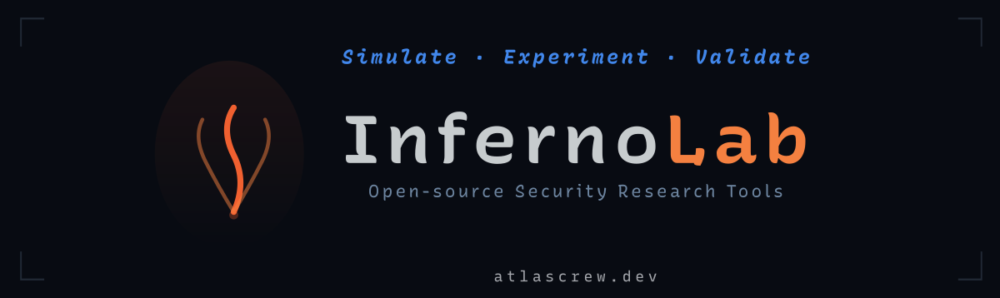
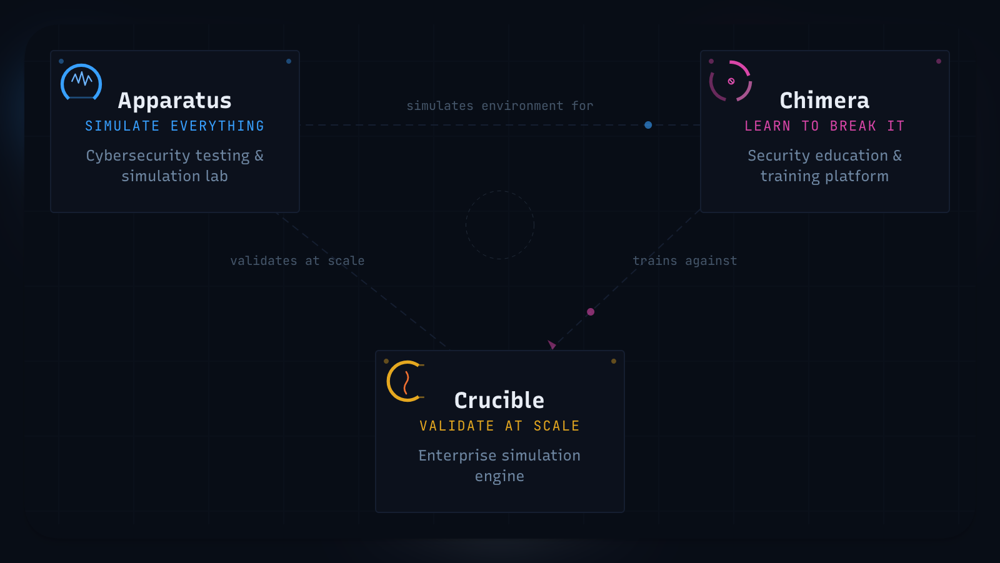

<p align="center">
  
</p>

**Inferno Lab** is a suite of open-source security testing products designed to work independently or together as an integrated platform.

## Products

**[Apparatus](https://github.com/inferno-lab/Apparatus)** — Network and security simulation and diagnostic platform with 58+ features spanning deception, chaos engineering, red team automation, and multi-protocol support (HTTP/2, gRPC, WebSocket, MQTT, and more).

**[Crucible](https://github.com/inferno-lab/Crucible)** — Attack simulation and compliance assessment engine with 80+ built-in scenarios, a visual editor, real-time execution, and pass/fail assessment scoring with enterprise reporting.

**[Chimera](https://github.com/inferno-lab/Chimera)** — Intentionally vulnerable application with 456+ endpoints across 25+ industry verticals for WAF testing, security research, and education.

## Quick Install

Each product is available as a standalone package. Install one or all three depending on your needs.

### Apparatus

```bash
# npm
npm install -g @atlascrew/apparatus
apparatus

# Docker
docker run -p 8090:8090 -p 8443:8443 nickcrew/apparatus
```

Dashboard at [localhost:8090/dashboard](http://localhost:8090/dashboard). CLI available separately via `npm install -g @atlascrew/apparatus-cli`.

### Crucible

```bash
# npm
npm install -g @atlascrew/crucible
crucible start

# Docker
docker run -p 3000:3000 nickcrew/crucible
```

Web UI at [localhost:3000](http://localhost:3000).

### Chimera

```bash
# pip
pip install chimera-api
chimera-api --port 8880 --demo-mode full

# Docker
docker run -p 8880:8880 -e DEMO_MODE=full nickcrew/chimera
```

Swagger UI at [localhost:8880/swagger](http://localhost:8880/swagger). Web portal at [localhost:8880](http://localhost:8880).

## Using the Products Together

<p align="center">
  
</p>

Apparatus and Crucible use Chimera as a high-fidelity vulnerable target for their simulations and assessments. Running all three together creates a complete security testing lab.

### Full Lab Setup

Start Chimera first (the target), then Apparatus (the simulation platform) and Crucible (the assessment engine), pointing them at the Chimera instance:

```bash
# 1. Start Chimera (vulnerable target)
docker run -d --name chimera -p 8880:8880 -e DEMO_MODE=full nickcrew/chimera

# 2. Start Apparatus (simulation platform)
docker run -d --name apparatus -p 8090:8090 -p 8443:8443 nickcrew/apparatus

# 3. Start Crucible (assessment engine) pointed at Chimera
docker run -d --name crucible -p 3000:3000 \
  -e CRUCIBLE_TARGET_URL=http://host.docker.internal:8880 \
  nickcrew/crucible
```

Or with npm:

```bash
# Terminal 1 — Chimera
chimera-api --port 8880 --demo-mode full

# Terminal 2 — Apparatus
apparatus

# Terminal 3 — Crucible pointed at Chimera
CRUCIBLE_TARGET_URL=http://localhost:8880 crucible start
```

### Apparatus + Chimera Integration

Chimera has a built-in Apparatus integration that enables ghost traffic generation and coordinated attack simulations:

```bash
# Start Chimera with Apparatus integration enabled
APPARATUS_ENABLED=true \
APPARATUS_BASE_URL=http://localhost:8090 \
chimera-api --port 8880 --demo-mode full
```

This exposes integration endpoints at `/api/v1/integrations/apparatus/*` and adds an Apparatus panel to the Chimera admin dashboard.

### Crucible + Chimera Assessments

Crucible's scenario catalog includes scenarios designed for Chimera's endpoints — covering SQL injection, IDOR, JWT manipulation, SSRF, and more across Chimera's industry verticals. Point Crucible at a running Chimera instance and run assessments from the web UI.

## Packages

| Package | Install | Registry |
| --- | --- | --- |
| **Apparatus** (server) | `npm i -g @atlascrew/apparatus` | [npm](https://www.npmjs.com/package/@atlascrew/apparatus) |
| **Apparatus CLI** | `npm i -g @atlascrew/apparatus-cli` | [npm](https://www.npmjs.com/package/@atlascrew/apparatus-cli) |
| **Apparatus Client Library** | `npm i @atlascrew/apparatus-lib` | [npm](https://www.npmjs.com/package/@atlascrew/apparatus-lib) |
| **Crucible** | `npm i -g @atlascrew/crucible` | [npm](https://www.npmjs.com/package/@atlascrew/crucible) |
| **Chimera** | `pip install chimera-api` | [PyPI](https://pypi.org/project/chimera-api/) |

| Docker Image | Pull |
| --- | --- |
| **Apparatus** | `docker pull nickcrew/apparatus` |
| **Crucible** | `docker pull nickcrew/crucible` |
| **Chimera** | `docker pull nickcrew/chimera` |

## Documentation

| Product | Docs | Source |
| --- | --- | --- |
| **Apparatus** | [apparatus.atlascrew.dev](https://apparatus.atlascrew.dev) | [inferno-lab/Apparatus](https://github.com/inferno-lab/Apparatus) |
| **Crucible** | [crucible.atlascrew.dev](https://crucible.atlascrew.dev) | [inferno-lab/Crucible](https://github.com/inferno-lab/Crucible) |
| **Chimera** | [chimera.atlascrew.dev](https://chimera.atlascrew.dev) | [inferno-lab/Chimera](https://github.com/inferno-lab/Chimera) |

## License

Copyright 2026 Nicholas Crew Ferguson
[MIT License](https://opensource.org/license/MIT)
